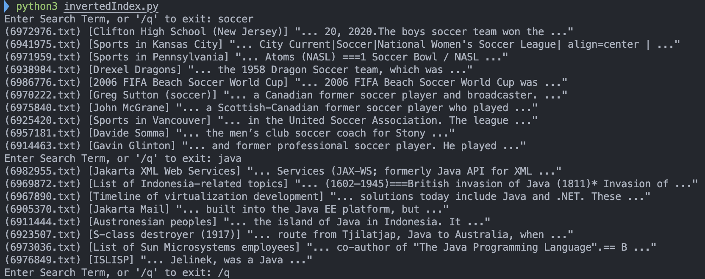

# Search Engine with Inverted Index Implementation

## Files/Directory:

-   **invertedIndex.py**: Loads data into inverted index and launches interface for keyword search engine. By default, it would display (at most) 10 documents per keyword, ordered by their TFIDF values.
-   **indexBuilder.py**: Runs MapReduce to tokenize and calculate TFIDF of keywords from documents
-   **normalizeText.py**: Contains functions for removing punctuation and stemming texts
-   **/documents10k**: Contains 10k wikipedia documents (make sure to first unzip **documents10k.zip**).
-   **output.txt**: Output from running **indexBuilder.py** using documents from **/documents10k** as input

## Running Search Engine Program

Launch the search engine with the following command:
`python3 invertedIndex.py`
By default, the program would use **output.txt** to load data into the inverted index. It lists (at most) 10 relevant documents for a keyword, ordered by their TFIDF values. For each displayed document, a snippet containing the searched keyword is also provided.

### Optional Command Line Arguments

**invertedIndex.py** takes 3 optional command line arguments.
`mr_output_file` sets the file that gets parsed by the program to load data into the inverted index. If such file does not exist, the program automatically launches MapReduce to generate the output file before prompting the search engine interface. By default, the MapReduce uses .txt files located in **/documents10k** directory. This can also be overriden in the command line, by setting `mr_input_path`. Finally, the user can choose the maximum number of relevant documents to list for a search by setting `k`.

For example, running `python3 invertedIndex.py mr_output_file=another_output.txt k=5` would use _another_output.txt_ file to load data into inverted index. If it doesn't exist, the program launches MapReduce program (**indexBuilder.py**) to generate the required file, using the .txt files in **documents10k** directory. The search engine would only display at most 5 documents per search.

`python3 invertedIndex.py mr_output_file=another_output.txt mr_input_path=./documents2k k=5` is similar to the previous command, but it would use .txt files in _documents2k_ directory as input to MapReduce instead if _another_output.txt_ file is missing. The program will terminate if _documents2k_ directory does not exist.

### Testing MapReduce

MapReduce can also be tested by running `python3 indexBuilder.py <input_files> --jobconf job.corpus_size=<total_documents>`, where `<total_documents>` is the total number of documents in the dataset. If this is not specified, the program uses 10000 by default to calculate tfidf.
